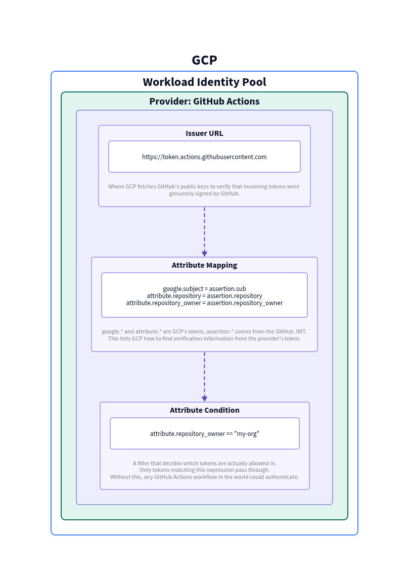
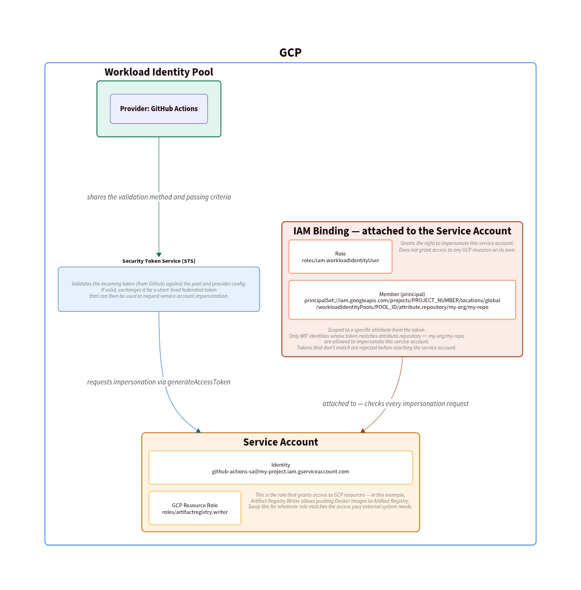
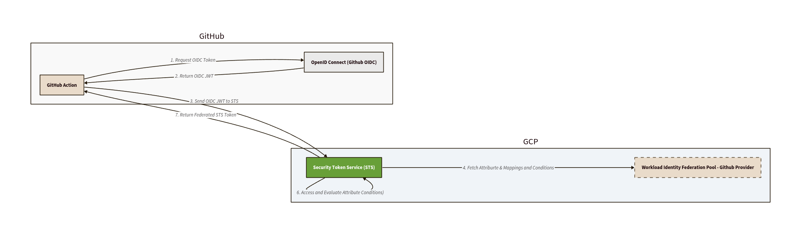
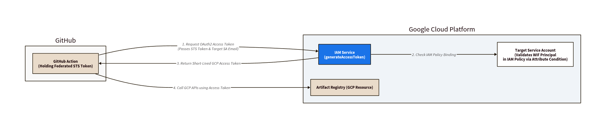
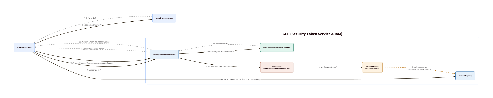

# Say Goodbye to Service Account Keys: Exploring Workload Identity Federation in GCP

## Why does this even exist?

When you have an external system — say, a GitHub Actions pipeline — that needs to authenticate to GCP, the classic way to do that was to create a **[service account](https://docs.cloud.google.com/iam/docs/service-account-overview)**, grant it with the necessary permissions, and [generate a service account key](https://docs.cloud.google.com/iam/docs/keys-create-delete) out of it in order to access GCP resources.

This works, but a service account key is effectively a permanent password and requires [high maintenance](https://docs.cloud.google.com/iam/docs/best-practices-for-managing-service-account-keys) to keep them secure. It doesn't expire on its own. If it leaks — that key stays valid until you go in and manually rotate or revoke it. It requires a lot of discipline and careful operational hygiene to manage and maintain them safely.

Workload Identity Federation is the answer to **"what if we just didn't use static keys at all?"**

The idea is that instead of using credential keys you created, GCP trusts tokens that are issued from the external system. Workload Identity Federation lets GCP say: **"I will trust this system as long as it's a recognized Identity Provider and the token meets the criteria I've established."** In return, once validated, you can get credentials that can be used to access GCP resources.

No keys to download, rotate, or accidentally commit! The credentials GCP gives back are short-lived by design — they expire after an hour. The next workflow run gets a fresh set.

## Deciding an Authentication Method: Direct Resource Access VS Service Account Impersonation

The complete authentication flow involves two parts:

1. GCP exchanging tokens with the [Identity Provider (IdP)](https://www.cloudflare.com/learning/access-management/what-is-an-identity-provider/) to acknowledge each other
2. Obtaining credentials (OAuth 2.0 tokens) from GCP to access the actual GCP resources

For the second part, GCP offers two methods for Workload Identity Federation:

- **Direct Resource Access**: Permissions are granted to the external identity on the GCP resources directly. For example, if you want a github action to be able to create GCS buckets, you would grant the [federated identity](https://cloud.google.com/iam/docs/workload-identity-federation#overview) with respective IAM roles on the GCS bucket resources directly.

- **Service Account Impersonation**: A single service account in GCP can be created with all the necessary permissions. External identities can then impersonate this service account to access GCP resources.

The choice of authentication method depends on the following:
1. Whether you practice Role-Based Access Control (RBAC) or Attribute-based Access Control (ABAC) - here's their [differences](https://www.okta.com/identity-101/role-based-access-control-vs-attribute-based-access-control/). Direct resource access is more in line with ABAC, while service account impersonation is more in line with RBAC.
2. How fine-grained your IAM permissions need to be: GCP resources only allow granting roles (which includes a predefined set of permissions) as the lowest possible level. If you practice least privilege access control, you might still need to create a service account to group the fine-grained permissions needed and then attach this service account to your GCP resources.
3. If you are already a GCP user with existing service accounts and using service account keys in your day-to-day operations, then using service account impersonation with Workload Identity Federation could be a good starting point for you to move away from using static keys without making major changes to your existing IAM policies. Read GCP's official guide on [Migrate from service account keys](https://docs.cloud.google.com/iam/docs/migrate-from-service-account-keys) for the best practices.


## How Workload Identity Federation  with Service Account Impersonation actually works (using Github Actions as example)

> Let's use a concrete example: Assume we are creating a Github Actions workflow that builds and pushes Docker images to GCP Artifact Registry, which requires us to authenticate via Workload Identity Federation  with proper IAM permissions using service account impersonation.

There are two sides to this setup:

### 1. The Identity Provider (IdP) side

An Identity provider (Idp) is simply an external system that can issue signed identity tokens.  There are many different types of identity providers in the market, so the first step is to identify which one of them is right for your use case, and [if they are recognized and supported by GCP](https://docs.cloud.google.com/iam/docs/workload-identity-federation#providers) for Workload Identity Federation. 

In our sample use case, the Identity Provider will be [OpenID Connect (OIDC)](https://docs.github.com/en/actions/concepts/security/openid-connect#how-oidc-integrates-with-github-actions) which is natively supported in Github Actions. We would request for the OIDC token directly from Github when the Github Actions workflow is triggered.

A Github Actions workflow that triggers a deployment would look like this:

```yaml
name: Deploy to GCP
on:
  push:
    branches: [ main ]
jobs:
  deploy:
    runs-on: ubuntu-latest
    permissions:
      contents: read
      id-token: write         # requests the OIDC token from OpenID Connect
    steps:
    - uses: actions/checkout@v4
    - id: auth
      uses: google-github-actions/auth@v2 
      with:
        workload_identity_pool: "<GCP Workload Identity Pool ID>"
        workload_identity_provider: "<GCP Workload Identity Provider ID>"
    - name: Deploy to GCP Resource
      run: echo "Deploying to GCP Resource..."
```

The `id-token: write` make requests for a temporary JWT that looks something like this:

```json
{
  "iss": "https://token.actions.githubusercontent.com",
  "sub": "repo:my-org/my-repo:ref:refs/heads/main",
  "aud": "<GCP Workload Identity Pool ID>",
  "repository": "my-org/my-repo",
  "repository_owner": "my-org",
  "ref": "refs/heads/main",
  "workflow": "Deploy",
  "exp": 1700000000
}
```

These fields inside the JWT are called **claims**. They're assertions the issuer is making about the identity. The `iss` claim is the issuer. The `sub` (subject) is who's being identified. The rest are context about the run. 

For Workload Identity Federation, these metadata fields serve as important pieces of information that can be used to verify the legitimacy of the token. We can configure GCP to recognize those claims instead of relying on static keys. 


### 2. The GCP side
You configure GCP to:
1. trust tokens from a specific external system. 
2. allow that external system to impersonate your service account to access GCP resources.

#### Configuring the Workload Identity Pool and Providers

First we need to create a **Workload Identity Pool** — it's a grouping container to organize your list of trusted 3rd party identity providers in GCP. Within the pool you can then register multiple different **Identity Providers**. For each provider, you would configure its own authentication methods and passing criteria (e.g., by using the JWT claims from OIDC tokens). You're teaching GCP how to trust tokens from that external system: where the tokens should come from, and what's the correct way to verify their legitimacy. In this setup you're saying "this pool has the list of specific identities I want to trust". Note that the actual token validation is not done by the pool itself — rather, it is done by the **Security Token Service (STS)** in a separate step, so the pool is only in charge of supplying the necessary info for STS to validate the token. One pool can hold providers for GitHub, GitLab, AWS, and more - as long as they support exchanging identity tokens. 

The authentication config is dictated by the following components:
1. **Issuer URL**: The provider URL that issues the tokens, to prove their identity as the 3rd party system.
2. **Attribute mapping**: Mapping of information between the provider's token and GCP (as the format could be different across providers).
3. **Attribute condition**: The passing criteria. Offers a unique way to define exactly which identities are allowed to access GCP. (e.g., only allowing specific GitHub repositories, branches, or users to access GCP). This is important to avoid [spoofing attacks](https://docs.cloud.google.com/iam/docs/best-practices-for-using-workload-identity-federation#multi-tenant-attribute-conditions) especially in Github

**The Workload Identity Pool and Provider Setup:**



#### Configuring Service Account Impersonation for the Workload Identity Pool
Setting up the pool and provider is not enough to grant permissions for the external system to access GCP resources, as the necessary permissions are still granted through your **Service Accounts**. Now instead of using keys to authenticate, you simply create an IAM binding on the service account to allow the external system and identity to impersonate it. 

This means after the GCP and Github acknowledge each other and establish trust through Workload Identity Federation token exchange, your workflow will have the permission to act as your service account to access GCP resources. 

**The Service Account and IAM Binding Setup:**



### Under the Hood: The Workload Identity Federation Token Exchange Process

Here's to breakdown what happened behind the scenes during the authentication:


1. The Github Actions workflow requests the OIDC token from Github and presents it to the Security Token Service (STS) in GCP
2. The STS verifies the OIDC token using the Workload Identity Pool and Provider configuration and exchanges it for a GCP token
3. The GCP token is sent back to the workflow to complete the authentication. 

Now both GCP and Github acknowledged each other but this is just the first step. The workflow is yet to have access to the actual GCP resources. Hence the next authentication step is needed to obtain the token from the impersonation service and act as the service account. 



1. The Github Action workflow clients takes the GCP federated token from the previous step to make a request to GCP's IAM service for a short-lived, Oauth 2.0 access token in order for the workflow to impersonate the service account
2. The new token has the same permissions as the service account and can be used to access GCP resources


### The Overall Workflow




## References

I would highly recommend going through GCP's documentation if you would like a step-by-step guide on how to implement Workload Identity Federation. The following resources are great places to start:

- [Workload identity Federation](https://docs.cloud.google.com/iam/docs/workload-identity)
- [Configure Workload Identity Federation with deployment pipelines](https://docs.cloud.google.com/iam/docs/workload-identity-federation-with-deployment-pipelines)