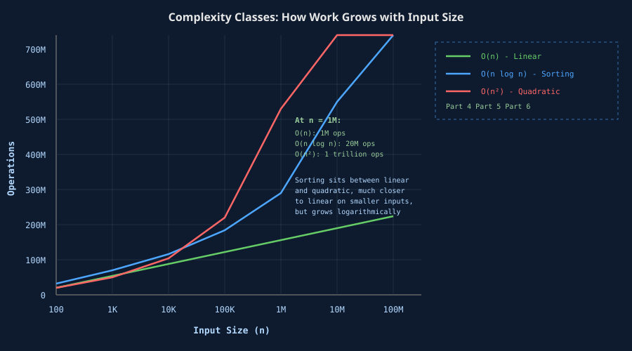
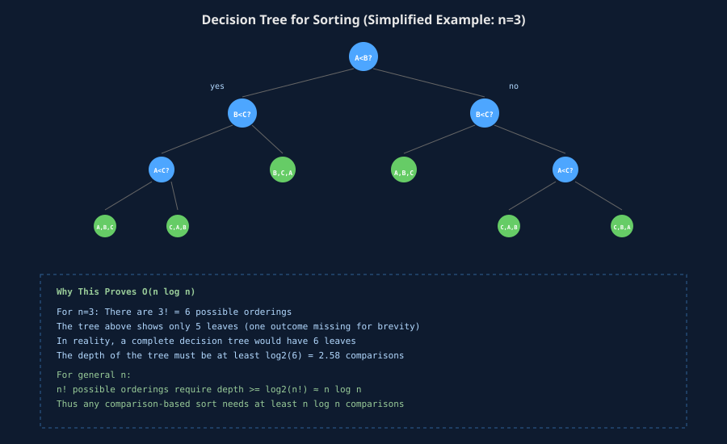
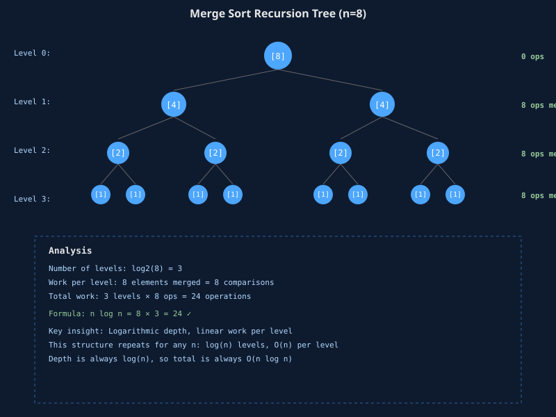

## The surprise hidden in sorted data

You touch every element once. O(n). Right?

Not with sorting. Sorting is the first algorithm where touching every element once is not enough. Sorting requires more.

In Part 4, we saw that reading through a list, summing values, or filtering rows all cost O(n). You walk the list once. Done. But sorting has a different contract. You have to put data in a specific order, and that order does not emerge from a single pass. It emerges from comparison, decision, and rearrangement.

The cost of that rearrangement is why sorting lives in its own complexity class: O(n log n).

Here is what surprised me when I first studied this: there is a mathematical proof that you cannot sort a list of n distinct elements with fewer than O(n log n) comparisons in the general case. Not "we have not found a better algorithm yet." Mathematically impossible. The proof is brief and clever, and understanding it changes how you think about data pipelines entirely.

## The doubling signature of O(n log n)

Before we prove anything, let us see the empirical shape of this complexity class. If you double the input size, what happens to the cost?

With O(n), doubling n doubles the work:

| n | O(n) |
| :--- | :--- |
| 100 | 100 |
| 200 | 200 |
| 400 | 400 |

With O(n log n), the picture is different:

| n | O(n log n) | Approx. ops |
| :--- | :--- | :--- |
| 100 | 100 × 6.6 | 660 |
| 200 | 200 × 7.6 | 1,520 |
| 400 | 400 × 8.6 | 3,440 |
| 1,000 | 1,000 × 9.9 | 9,900 |
| 10,000 | 10,000 × 13.3 | 133,000 |
| 1,000,000 | 1,000,000 × 19.9 | 19,900,000 |

The pattern is clear: when you double n, the work does not double. It multiplies by slightly more than 2. At n = 100, the log factor is 6.6. At n = 1,000,000, it is 19.9. The log term grows, but slowly.

This puts O(n log n) between O(n) and O(n²):

| n | O(n) | O(n log n) | O(n²) |
| :--- | :--- | :--- | :--- |
| 100 | 100 | 660 | 10,000 |
| 1,000 | 1,000 | 9,900 | 1,000,000 |
| 10,000 | 10,000 | 133,000 | 100,000,000 |
| 1,000,000 | 1,000,000 | 19,900,000 | 1,000,000,000,000 |

At n = 1,000, sorting at O(n log n) costs 9,900 operations. A quadratic algorithm would cost 1,000,000. At n = 1,000,000, sorting costs roughly 20 million. Quadratic costs a trillion. The gap widens as n grows, but it is still much steeper than linear.

This shape—growing faster than n, but slower than n squared—is the defining fingerprint of O(n log n).



## Why O(n) sorting is mathematically impossible

Sorting has a mathematical lower bound. You cannot sort faster than O(n log n) comparisons when you are sorting by comparison alone.

Here is the proof, and it is elegant:

Imagine a sorting algorithm works by asking "Is A less than B?" over and over. Each comparison has two possible answers: yes or no. Each answer narrows down which final orderings are still possible.

Start with n elements. There are n! (n factorial) possible orderings. A sorting algorithm must distinguish between all of them. It does so through a binary decision tree: each comparison is a branch point, and every leaf is one final ordering.

For a binary tree to have n! leaves, it must have a depth of at least log2(n!).

Using Stirling's approximation, log2(n!) is approximately n × log2(n).

Therefore, you need at least n × log2(n) comparisons to guarantee you can sort any input of size n.

Here is the calculation for different input sizes:

| n | n! | log2(n!) | n log n |
| :--- | :--- | :--- | :--- |
| 5 | 120 | 6.9 | 11.6 |
| 10 | 3,628,800 | 21.8 | 33.2 |
| 100 | 9.3 × 10^157 | 526.8 | 664.4 |
| 1,000 | 4.0 × 10^2567 | 8,530 | 9,965 |

The message is simple: in the worst case, any comparison-based sorting algorithm must perform at least n log n comparisons. You cannot sort faster.

This is not a limitation of current algorithms. This is a proof that faster algorithms do not exist.



## Merge sort: the canonical O(n log n) algorithm

Merge sort is the textbook example of O(n log n) sorting. It divides the problem in half recursively, then merges the sorted halves back together.

Here is the algorithm:

```python
def merge_sort(arr):
    if len(arr) <= 1:
        return arr
    
    mid = len(arr) // 2
    left = merge_sort(arr[:mid])
    right = merge_sort(arr[mid:])
    
    return merge(left, right)

def merge(left, right):
    result = []
    i = j = 0
    
    while i < len(left) and j < len(right):
        if left[i] <= right[j]:
            result.append(left[i])
            i += 1
        else:
            result.append(right[j])
            j += 1
    
    result.extend(left[i:])
    result.extend(right[j:])
    return result
```

To understand why this is O(n log n), we need to look at the recursion tree.

When we call merge_sort on an array of size n:

1. We split it into two arrays of size n/2.
2. We recursively sort each half.
3. We merge them back together. Merging two sorted arrays of size n/2 each takes O(n) work: we compare elements one at a time and place them in order.

The recursion repeats. At level 1, we do O(n) work to merge. At level 2, we have 2 subproblems of size n/2, and each merge takes O(n/2). Total work at level 2: O(n). At level 3, we have 4 subproblems of size n/4, and the total work is still O(n).

How many levels are there? We divide by 2 each time, so there are log(n) levels. Each level costs O(n) work.

Total: log(n) levels × O(n) work per level = O(n log n).

Here is what that looks like empirically (n = 8):

| Level | Structure | Work |
| :--- | :--- | :--- |
| 0 | [8] | 1 array, 8 elements, 0 comparisons yet |
| 1 | [4] [4] | split, merge: 8 comparisons |
| 2 | [2] [2] [2] [2] | split, merge: 8 comparisons |
| 3 | [1] [1] [1] [1] [1] [1] [1] [1] | split, merge: 8 comparisons |

**Total:** 3 levels × 8 comparisons per level = 24 ops. Since log₂(8) = 3, n log n = 8 × 3 = 24.



This recursion tree structure is the skeleton of every O(n log n) algorithm. A logarithmic number of passes, each touching all n elements once.

## Quicksort's average case: not always O(n log n)

Quicksort is faster than merge sort in practice on many datasets, and it also averages to O(n log n). But it is not O(n log n) all the time.

Quicksort picks a pivot element and partitions the array around it:

```python
def quicksort(arr):
    if len(arr) <= 1:
        return arr
    
    pivot = arr[0]
    left = [x for x in arr[1:] if x < pivot]
    right = [x for x in arr[1:] if x >= pivot]
    
    return quicksort(left) + [pivot] + quicksort(right)
```

If the pivot is chosen well, it splits the array roughly in half each time. This gives the same recursion tree as merge sort: log(n) levels, each costing O(n) work. Total: O(n log n).

But if the pivot is chosen poorly (say, always the smallest or largest element), the array splits into one element and n-1 elements. Then you recurse n times, and the cost becomes O(n²).

Here is the key difference from merge sort:

- Merge sort: O(n log n) guaranteed, every time.
- Quicksort: O(n log n) on average if the pivot is random, O(n²) worst case.

That worst case is coming in Part 6. For now, know this: Quicksort's average case matches merge sort, but it can degrade catastrophically if the pivot is unlucky. Production systems that use quicksort add randomization (random pivot selection) or use median-of-three heuristics to avoid the worst case.

## Python's Timsort: practical meets mathematical

Python does not use pure merge sort or pure quicksort. It uses Timsort, a hybrid algorithm designed by Tim Peters for real data.

Timsort starts by identifying runs (already-sorted subsequences) in the input. If the data is already partially sorted (which real data often is), Timsort finds those runs and extends them. Then it merges the runs together.

```python
# Conceptual structure of Timsort
# (Python's actual implementation is more complex)

def timsort(arr, min_run=32):
    # Find natural runs in the data
    runs = []
    for i in range(0, len(arr), min_run):
        run = arr[i:i+min_run]
        runs.append(insertion_sort(run))
    
    # Merge runs together
    while len(runs) > 1:
        merged_runs = []
        for i in range(0, len(runs), 2):
            if i + 1 < len(runs):
                merged_runs.append(merge(runs[i], runs[i+1]))
            else:
                merged_runs.append(runs[i])
        runs = merged_runs
    
    return runs[0]
```

Why is this clever? Because sorted data is common in practice:

- Data from a database query is often already sorted by primary key.
- Data from a previous pipeline stage may have residual order.
- Data read from disk in chunks tends to have locality.

On purely random data, Timsort is O(n log n), same as merge sort. But on data with existing runs, it can be faster than O(n log n). It exploits structure when structure exists, and does not penalize the algorithm when it does not.

This is why Timsort is the default sort in CPython, Java, and Android. It is a reminder that the complexity class is the floor, but constant factors and real-world structure matter more than the theory suggests.

## Where sorting happens in production

Sorting is not just a teaching example. It is baked into real data pipelines.

Consider a Spark sort-merge join:

```python
# PySpark pseudocode
df1.join(df2, on="id", how="inner").collect()
```

What Spark actually does:

1. Shuffle the data so all rows with the same id land on the same partition.
2. Sort each partition by id.
3. Merge the sorted partitions.

The shuffle is O(n). The sort is O(n log n). The merge is O(n). The join itself is O(n) (assuming unique or near-unique keys). The bottleneck is the sort.

If the input is 100 GB:

- O(n) shuffle: 100 GB scanned once.
- O(n log n) sort: 100 GB scanned, then split, recursively sorted, and merged. log(100 GB) in terms of records, not bytes. Still O(n log n), but with a large constant factor.

On a modern cluster, that sort can take 10s of seconds to minutes for a 100 GB table. Shave the constant factor by 2, and you save 5-10 seconds. This is why database query optimizers obsess over sort order.

Another example: database indexes. When you create an index on a column, the database sorts the data into a B-tree structure. A table with 10 million rows gets sorted once during index creation. That is O(10 million × log 10 million) = roughly 230 million comparisons. On a modern CPU doing ~1 billion comparisons per second, that is a quarter of a second. Quick, but not free.

If you create 10 indexes on the same table, that is 10 sorts. Still fast per sort, but the time adds up.

The lesson: sorting is expensive relative to scanning. Avoid it when you can. When you cannot avoid it, optimize for it.

## Why sorting is the speed limit

Here is the productive way to think about O(n log n):

**Sorting is the algorithmic speed limit for any comparison-based operation that requires global knowledge.**

If you need to know the order of all n elements without additional structure (like hash distribution or numeric range), you have to do at least O(n log n) work. You cannot do it in O(n).

This is not because engineers have not tried hard enough. It is because the mathematical structure of comparison-based sorting forbids it.

Every data engineering pattern that requires ordering—joins, grouping, rank window functions, median calculations—bottlenecks here. Unsorted pipelines force this cost. Sorted pipelines amortize it.

> **Can I ever sort faster than O(n log n)?**
>
> Yes, but only if you exploit structure. Counting sort, radix sort, and bucket sort are O(n + k) where k is the range of values. If you are sorting integers in a known range, or sorting by a discrete category, these beat O(n log n). But for general-purpose sorting of arbitrary comparable objects, O(n log n) is the floor.

---

## The rule of thumb

When you see sorting in a pipeline, budget for O(n log n) cost, not O(n). If the input doubles, expect the work to increase by a factor of 2.1 or 2.2, not 2. If you are sorting millions of rows, that log factor is already nontrivial. Thousands of times heavier than linear.

Next: what happens when sorting goes wrong. Part 6 covers O(n²): the nested loop trap, quicksort worst case, and why accidental quadratic behavior is the most common performance bug in production systems.

