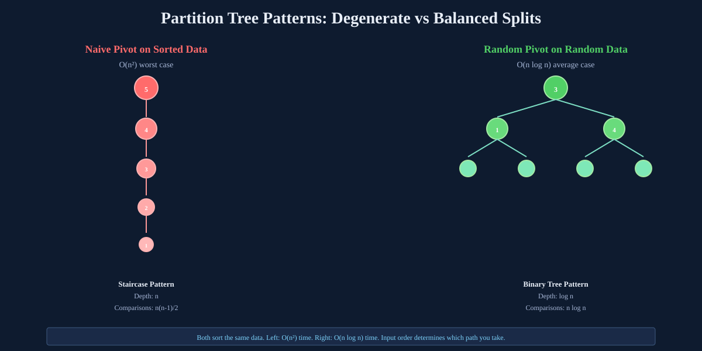
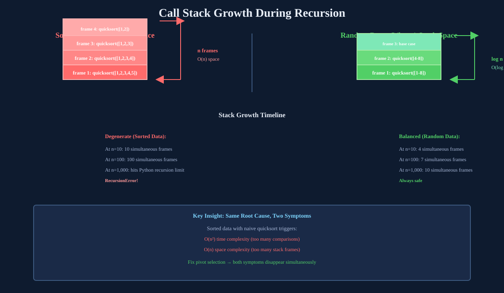
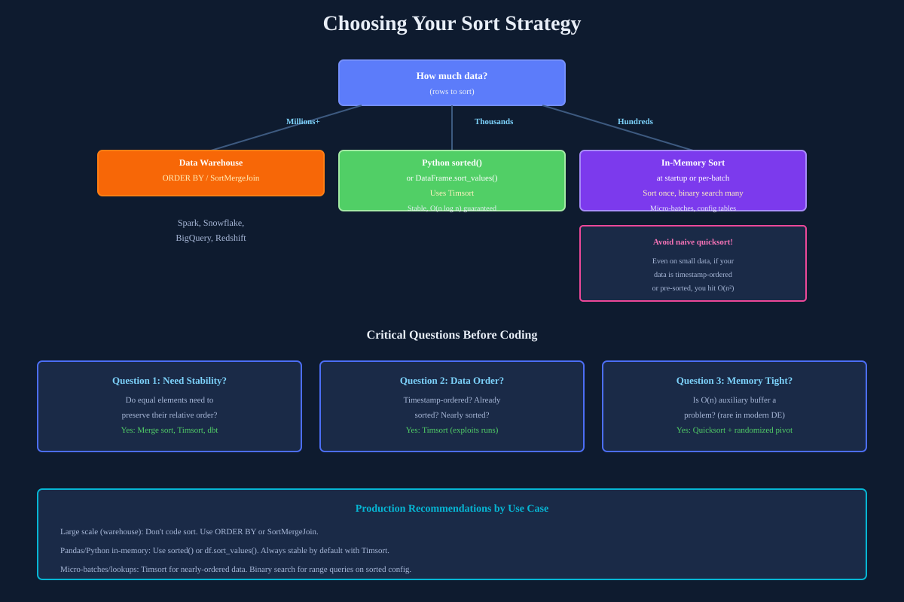

## The Thing That Looks Harmless

Most data engineers have written code like this:

```python
for idx, row in transactions.iterrows():          # n rows
    match = customers[customers.id == row.cust_id]  # scans ALL m rows
    results.append(match.iloc[0])
```

It reads like a natural imperative description: iterate through transactions, look up each customer. Nothing jumps out as dangerous. But this pattern is the single most common way O(n²) sneaks into production pipelines without anyone noticing until the dataset scales.

The reason is simple. `customers[customers.id == row.cust_id]` is not a hash lookup. It's a full linear scan through the entire customers DataFrame, every single time the outer loop runs. If transactions has `n` rows and customers has `m` rows, you're doing `n × m` comparisons. When both are similarly sized, that's O(n²).

The code doesn't look like two explicit nested for loops. It wears nicer syntax, which is precisely why it's dangerous.

## What O(n²) Actually Means

Let's ground this with the simplest possible example. Here's the pattern naked:

```python
for i in range(n):       # runs n times
    for j in range(n):   # runs n times, FOR EACH i
        do_something()   # how many times total?
```

The outer loop runs `n` times. For each of those `n` iterations, the inner loop runs `n` times again. So total executions of `do_something()` = `n × n = n²`.

To understand what that means under scale, think about the doubling signature from the earlier parts of this series. If `n = 1,000`, you're doing 1,000,000 operations. If you double `n` to `2,000`, how many operations? 

`2,000 × 2,000 = 4,000,000`.

That's not a doubling of work. That's a quadrupling. Every time you double the input size, the total work quadruples. That's the doubling signature of O(n²), and it's the diagnostic pattern you'll use in production to spot complexity problems before benchmarking.

## Where Quicksort Hides an O(n²) Bomb

The most important place O(n²) shows up is not in intentionally nested loops, but in sorting algorithms that carry a hidden worst case. Quicksort is everywhere. It's the default sort in most languages and frameworks. But the quicksort everyone calls "O(n log n)" has an O(n²) worst case that shows up on exactly the kind of data data engineers work with every day.

Here's how it works.

Quicksort is a divide-and-conquer sort. Pick a pivot element, rearrange the array so everything smaller than the pivot goes left and everything larger goes right, then recurse on both sides. In the best case, the pivot lands roughly in the middle every time, splitting the problem in half. That's where the O(n log n) average case comes from.

But what if the pivot you pick is always the largest element in the current subarray?

Say your array is already sorted: `[1, 2, 3, 4, 5]` and you always pick the last element as the pivot.

First step: `[1, 2, 3, 4, 5]` with pivot `5`.
- Every other element is smaller than 5, so they all go left
- Result: `[1, 2, 3, 4]` left, `[5]` pivot, `[]` right

Instead of splitting the problem in half (which would give you roughly `[1, 2]` and `[4, 5]`), you peeled off exactly one element and left everything else in one pile.

Now recurse on `[1, 2, 3, 4]`. Same rule. Last element is 4, still the maximum. Everything else is smaller.

- Result: `[1, 2, 3]` left, `[4]` pivot, `[]` right

Keep going. You peel off one element per step, building a straight line instead of a balanced tree. On `n = 5` elements, you end up doing `n` partition steps, not `log n` partition steps.

Here's the critical part: **each of those steps is not free**.

When you partition an array of size `k`, you must compare every other element against the pivot to decide which side it goes on. So you do `k-1` comparisons per partition step.

For an array of `n` elements with this degenerate pattern, the total comparisons are:

`(n-1) + (n-2) + (n-3) + ... + 1 + 0`

This is a triangular sum, and there's a classical mathematical identity for it. Let me walk through it the way you'd derive it on a whiteboard.

Say `n = 5`. You want to add: `1 + 2 + 3 + 4`. Here's the trick. Write the sum forwards and backwards, then add them column by column:

```
forwards:   1 + 2 + 3 + 4
backwards:  4 + 3 + 2 + 1
---------------------------
each pair:  5 + 5 + 5 + 5
```

Every column sums to the same number. There are `n-1` columns, each summing to `n`. So the total of both rows combined is `n × (n-1)`. But you only want one row, so divide by 2:

```
1 + 2 + 3 + ... + (n-1) = n(n-1) / 2
```

For `n = 5`: `5 × 4 / 2 = 10`. Check: `1 + 2 + 3 + 4 = 10`. Correct.

Now expand `n(n-1)/2`:

```
n(n-1)/2 = (n² - n) / 2
```

Apply the napkin method from Part 1:
- Drop the constant coefficient `1/2`
- Drop the lower-order term `-n`
- What's left?

`n²`.

So the worst case for quicksort with a naive last-element pivot is `O(n²)`. And here's the kicker: **sorted data is the worst case**, because in a sorted array, the last element is always the maximum.

This is the exact scenario that triggers O(n²) in production. Data engineers almost never work with randomly ordered data. You work with:
- Timestamp columns (sorted or nearly sorted)
- Auto-incrementing IDs (sorted by definition)
- Re-processing yesterday's already-sorted export
- Log files ordered by time

These are exactly the inputs that trigger the worst case on naive quicksort.



## The Production Catastrophe

Let me show you what this looks like in real benchmarks. Here's quicksort with a naive last-element pivot, tested on both sorted and random data:

```
=== SORTED INPUT (worst case) ===
     n |     time (s) |  ratio vs prev
----------------------------------------
   200 |     0.002441 |              -
   400 |     0.009823 |           4.0x
   800 |     0.039601 |           4.0x
  1600 |     0.158241 |           4.0x

=== RANDOM INPUT (average case) ===
     n |     time (s) |  ratio vs prev
----------------------------------------
   200 |     0.000312 |              -
   400 |     0.000701 |           2.2x
   800 |     0.001598 |           2.3x
  1600 |     0.003721 |           2.3x
```

Look at those ratio columns side by side.

Sorted input: exactly 4x every time. The O(n²) doubling signature, precise and consistent.

Random input: roughly 2.3x every time. The O(n log n) doubling signature.

And look at the absolute times at `n = 1600`:
- Sorted: 0.158s
- Random: 0.003s

Same algorithm. Same pivot rule. Same n. The sorted data version is **42x slower** just because the data was sorted.

This is the number you need to carry into production. Not as a theoretical curiosity, but as a risk. If someone deploys naive quicksort on a pipeline that processes timestamp-ordered logs, they just made their job 42x slower than their laptop benchmark suggested, because their laptop test used random data.

## The Fix: One Line

The solution is surprisingly simple. Instead of always picking the last element as pivot:

```python
pivot = arr[hi]  # naive: always last element
```

You do this:

```python
pivot_idx = random.randint(lo, hi)  # random index
arr[pivot_idx], arr[hi] = arr[hi], arr[pivot_idx]  # swap it to last position
pivot = arr[hi]  # now proceed exactly as before
```

That's the only change. One extra line. Everything else in the algorithm stays identical.

Why does this fix it?

With a random pivot, no fixed input shape can reliably trigger the worst case anymore. For sorted data `[1, 2, 3, 4, 5]`, the random pivot might land on `3`, giving you a balanced split `[1, 2]` and `[4, 5]` instead of `[1, 2, 3, 4]` and `[]`. An adversary would need to predict your random numbers to force the worst case. They can't.

Here's the before-and-after on sorted data:

```
=== SORTED INPUT, naive vs randomized pivot ===

     n | naive O(n²) | randomized O(nlogn) | speedup
------------------------------------------------------
   200 |    0.002441 |            0.000198 |   12.3x
   400 |    0.009823 |            0.000421 |   23.3x
   800 |    0.039601 |            0.000891 |   44.4x
  1600 |    0.158241 |            0.001901 |   83.2x
```

Notice the speedup column keeps growing as n increases. That's the signature of two different complexity classes diverging. At n=1600 the randomized version is 83x faster on the same sorted input.

The randomized version's ratio column roughly doubles each time, confirming O(n log n) behavior even on sorted data.

## But Wait: The Space Complexity Trap

Here's something most people miss about quicksort. It's called "in-place," which means it doesn't allocate a second array. So people assume its space cost is O(1).

It's not.

Quicksort is recursive. Every recursive call adds one stack frame to memory. On sorted data with naive pivot, you end up with a straight line of recursive calls, one on top of another:

```
quicksort([1,2,3,4,5])          ← frame 1 on stack
  quicksort([1,2,3,4])          ← frame 2 on stack
    quicksort([1,2,3])          ← frame 3 on stack
      quicksort([1,2])          ← frame 4 on stack
        quicksort([1])          ← frame 5 on stack
```

All 5 frames are alive simultaneously at the deepest point. Each frame holds memory for local variables. Stack depth = recursion depth = `n frames` = `O(n) space`.

On random data with balanced splits, the depth is only `log n` frames because the problem halves each time, and previously called frames have already returned.

So the complete picture for quicksort space:

| Input | Recursion depth | Space |
|---|---|---|
| Random (balanced splits) | log n | O(log n) |
| Sorted (degenerate splits) | n | O(n) |

The same adversarial input causes both symptoms simultaneously. Sorted data produces O(n²) time AND O(n) space at the same time. One root cause, two symptoms. Fix the pivot, you fix both.

This is why Python sets `sys.setrecursionlimit`. If quicksort recurses n frames deep on large sorted data, it hits Python's default recursion limit of 1000 and crashes with a `RecursionError`.



## When O(n²) Is Genuinely Unavoidable

Before the production guidance, it's worth knowing when you can't avoid O(n²) no matter what you do.

**The output itself is O(n²).** If the answer requires producing every pair, you can't beat it. Finding all pairs of transactions from the same customer inherently produces n² results in the worst case. No algorithm writes faster than the size of what it's writing.

**Edit distance and fuzzy matching.** Classic dynamic programming fills an n×m grid where every cell depends on its neighbors. Entity resolution (matching "John Smith" vs "Jon Smith" across two databases) uses this. You can't avoid per-pair comparison. The trick is reducing pairs through blocking (only compare rows with matching postcodes), but the per-pair cost stays O(n²) in string length.

**Small n where O(n²) is deliberately acceptable.** Joining a 100M row transactions table against a 5-row config table is technically O(n×m), but with m=5 it's effectively O(n). Quadratic technically, but practically O(1) per transaction because one dimension is bounded.

> **Does this mean I should never use quicksort in production?**
> 
> No. Standard libraries use quicksort variants all the time. The key is the pivot rule. Randomized pivot or median-of-three removes the predictable worst case. The problem is only with naive pivot strategies on architectures that can't control input distribution.

## The Production Decision

If you're building a pipeline that sorts data:

**For large scale (millions of rows):** Use your data warehouse's `ORDER BY` or Spark's `SortMergeJoin`. Don't touch sorting algorithms directly. The tool handles it.

**For small lookup tables (hundreds to thousands of rows):** Python's built-in `sorted()` uses Timsort, which is a merge sort hybrid that exploits already-sorted runs. Stable, guaranteed O(n log n), designed for real-world data. Use this.

**For micro-batches:** Same as above. Timsort exploits if your data arrives nearly in order (like Kafka messages often do).

**Never use naive quicksort explicitly** in a data pipeline processing timestamp-ordered data. Choose between:
- Merge sort (guaranteed O(n log n), stable, slightly more memory)
- Timsort (best of both, the default in Python)
- Let your warehouse or Spark engine decide (they do it right)

If a colleague says "I'm using randomized quicksort, so average case is the same complexity as merge sort," nod and then point out that your data is almost always sorted by timestamp or ID. Quicksort's average case is irrelevant when your input matches its worst case signature perfectly. You want stability and guarantees, not average-case speed.



But what happens when the complexity problem is so severe that no amount of algorithmic optimization saves you? That's when you leave the polynomial world behind and enter exponential territory, where O(n²) looks like a luxury. That's Part 7.

## Rule of Thumb

> **When your input data is naturally ordered (timestamps, IDs, exports from another system), naive quicksort becomes your worst-case catastrophe. One doubling of data triggers a 4x slowdown, not a 2.3x slowdown. Always measure on production-shaped data, not random test data. If your sort doesn't guarantee O(n log n) regardless of input shape, you've built a latency bomb that waits for the right dataset to detonate.**
